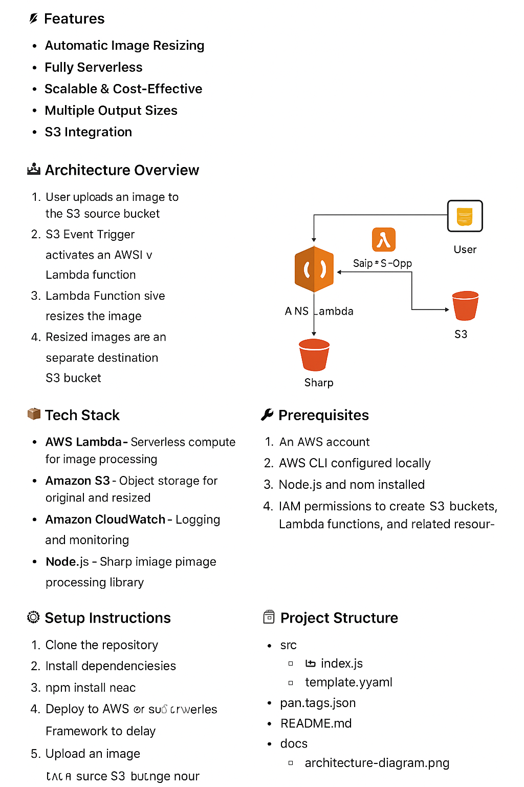

# Serverless Image Resizer on AWS

A fully serverless and cost-efficient image resizing solution built on **AWS Lambda** and **Amazon S3**.  
This project automatically resizes images on-the-fly when they are uploaded to an S3 bucket, eliminating the need for manual image processing and reducing storage costs.

---

## 🚀 Features
- **Automatic Image Resizing** – Triggered upon file upload.
- **Fully Serverless** – No EC2 instances or manual infrastructure management.
- **Scalable & Cost-Effective** – Pay only for what you use.
- **Multiple Output Sizes** – Generate different sizes from a single original image.
- **S3 Integration** – Stores both original and resized images efficiently.

---

## 🏗 Architecture Overview
1. **User Uploads Image** to the S3 source bucket.
2. **S3 Event Trigger** activates an AWS Lambda function.
3. **Lambda Function** resizes the image to pre-defined dimensions using `sharp` (or similar library).
4. **Resized Images** are stored in a separate destination S3 bucket or a subdirectory.

---

## 📦 Tech Stack
- **AWS Lambda** – Serverless compute for image processing
- **Amazon S3** – Object storage for original and resized images
- **Amazon CloudWatch** – Logging and monitoring
- **Node.js** – Lambda runtime (with Sharp image processing library)

---

## 🔧 Prerequisites
Before you begin, make sure you have:
- An **AWS account**
- **AWS CLI** configured locally
- **Node.js** and **npm** installed
- IAM permissions to create S3 buckets, Lambda functions, and related resources

---

## ⚙️ Setup Instructions

Running the command above will zip your source code and dependencies. The zip can then be uploaded to your Lambda.
| Key          | Value                                                                                      |
| ------------ | ------------------------------------------------------------------------------------------ |
| Environment  | LocalStack, AWS                                                                            |
| Services     | S3, Lambda, SNS, SES, SSM                                                                  |
| Integrations | AWS SDK, AWS CLI,                                                                          |
| Categories   | Serverless, image resizer, S3 website, Lambda function                                     |
| Level        | Intermediate                                                                               |
| Use Case     | Lambda DevX, Integration Testing                                                           |
| GitHub       | [Repository link](https://github.com/Ayushpatel1304/AWS-Serverless-Image-Resizer) |

## ⚙️ Setup Instructions

1️⃣ Clone the Repository

git clone https://github.com/yourusername/serverless-image-resizer.git
cd serverless-image-resizer

2️⃣ nstall Dependencies
npm install

3️⃣ Deploy to AWS
You can use AWS SAM or Serverless Framework to deploy:

sam build
sam deploy --guided

4️⃣ Upload an Image
Upload an image to the source S3 bucket.

Check the destination bucket for resized versions
